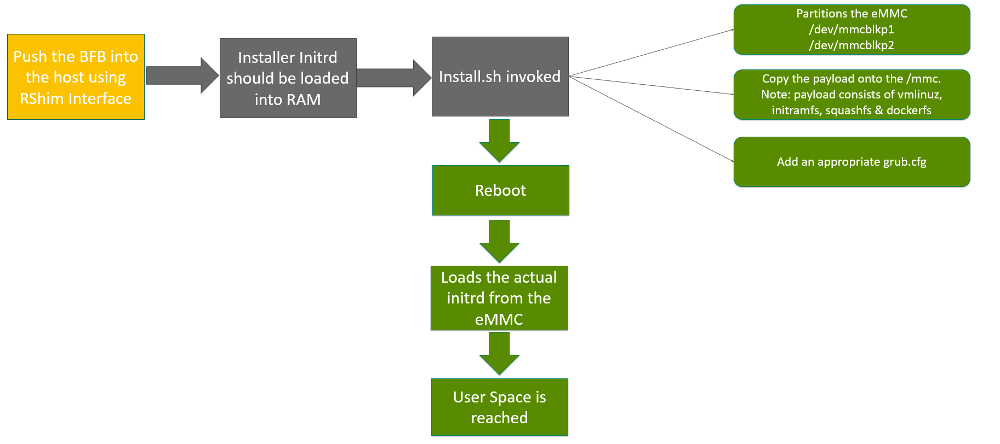
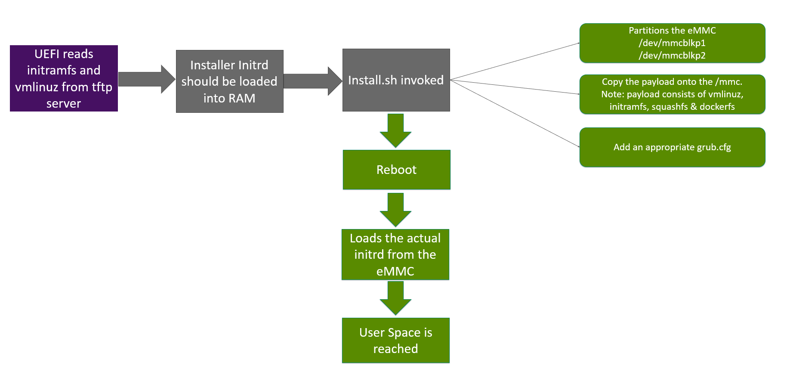

# Booting SONiC NOS on Bluefield  #
#### Rev 1.0

# Table of Contents
  * [Revision](#revision)
  * [About this Manual](#about-this-manual)
  * [Definitions/Abbreviation](#definitionsabbreviations)
  * [1. Deploying OS onto Bluefield](#deploying-os-onto-bluefield)
    * [1.1 BFB Boot Flow](#11-bfb-boot-flow)
    * [1.2 PXE Boot Flow](#12-pxe-boot-flow)
  * [2. SONiC Installer Images](#sonic-installer-images)
    * [2.1 SONiC BFB Image](#21-sonic-bfb-image)
    * [2.2 SONiC PXE Archive](#22-sonic-pxe-archive)
  * [3. PXE Setup](#pxe-setup)
    * [3.1 DHCP Additional Configuration](#31-dhcp-additional-configuration)
    * [3.2 GRUB Configuration](#32-grub-configuration)
  * [4. PXE Boot](#pxe-boot)
  * [5. BMC Flow](#bmc-flow)
    *  [5.1 Force PXE BootFlag](#51-force-pxe-bootflag)
    *  [5.2 Remote Reboot](#52-remote-reboot)
  
### Revision  

| Rev |     Date    |       Author       | Change Description          |
|:---:|:-----------:|:-------------------------|:----------------------|
| 1.0 | 01/23/2021  | Vivek Reddy              | Initial version       |

## About this Manual
This document sheds light on the details of booting SONiC NOS on Bluefield using various approaches such as BFB & PXE. It also describes instructions on how to setup the infrastructure which could facilitate PXE booting.

## Definitions/Abbreviations
###### Table 1: Abbreviations
| Abbreviation | Description                                                  |
| ------------ | ------------------------------------------------------------ |
| PXE          | Preboot Execution Environment                                |
| BFB          | Bluefield Bootstream                                         |
| UEFI         | Unified Extensible Firmware Interface                        |
| ATF          | ARM Trusted Firmware                                         |
| BMC          | Baseband Management Contoller                                |
| RShim        | A virtual Ethernet Interface connecting to BF from the Host (via USB or PCIe) |
| OOB          | Out of Band Management Port |

## Deploying OS onto Bluefield

OS on the Bluefield can be upgraded just by pushing the BFB file from the RShim interace on the host. Detailed explanation about this installation process can be found here (https://docs.nvidia.com/networking/category/bluefieldsw). 
PXE on the other hand facilitates network booting. PXE works on OOB, RSHIM and also the Connect-X Interfaces if the FW Supports. BFB can only be pushed through RSHIM Iface.

Although these two approaches differ fundamentally, their last step of booting is to deliver the installer vmlinuz and initramfs.

### 1.1 BFB Boot Flow



### 1.2 PXE Boot Flow



## SONiC Installer Images

Traditionally, SONiC used to run on devices which had ONiE partition pre-installed. Thus a single `*.bin` image was being used to boot from ONiE and also for SONiC-SONiC Installer Upgrade Process. 

Since, the Bluefield card doesn't have ONiE support, `*.bin` image cannot be used for booting but can still be used for SONiC-SONiC Image Upgrade Process.

In addition to `*.bin` image, there are two other formats are introduced for `nvidia-bluefield` platform

### 2.1 SONiC BFB Image

The SONiC BFB Image can be built by runnig: `NOJESSIE=1 NOSTRETCH=1 make target/sonic-nvidia-bluefield.bfb`

Additionally, this can be loaded onto a Bluefield using from the host using

`bfb-install -b sonic-nvidia-bluefield.bfb -r rshim<N>` or `cat sonic-nvidia-bluefield.bfb > /dev/rshim<N>/boot`

The rshim console can also be used to view the logs emitted during the boot process. 
`minicom -D /dev/rshim<N>/console`

To enable the debugging logs during the BFB Boot process, create a bf.cfg file with line `export DEBUG=yes` and provide this file as an extra argument for the bfb-install command

`bfb-install -b sonic-nvidia-bluefield.bfb -r rshim<N> -c bf.cfg` 
After the booting process is finished, logs can be found in the /dev/mmcblk0p2 partition under /host/bfb-boot-logs/ directory.

### 2.2 SONiC PXE Archive

This is a compressed archive which can be generated using: 
`NOJESSIE=1 NOSTRETCH=1 make target/sonic-nvidia-bluefield.tar.gz`

To enable the debugging logs during the PXE Boot process, add `logging=true` to the kernel cmdline parameters in grub.cfg

Note: Running this will also generate a sonic-nvidia-bluefield.bfb as a by-product

## PXE Setup 

On Extracting the SONiC PXE Archive, these files will be seen:

```
PXE_README.txt 
initramfs          => Installer Initramfs
Image              => Installer Vmlinux
grubnetaa64.efi    => Grub EFI Binary. 
grub.cfg           => This specifies the path in the TFTP server on where to find Initramfs and Vmlinuz
```

### 3.1 DHCP Additional Configuration

The Vendor Class Option in the DHCP request for PXE Boot coming from the Bluefield Device is programmed to be "BF2Client". 
Thus an example configuration 

#### Example DHCP Configuration Addition:
```
if substring (option vendor-class-identifier, 0, 9) = "BF2Client" {
      filename "grubnetaa64.efi";  
}
```

### 3.2 GRUB Configuration
Once the Bluefield Device recieves this response with the TFTP server information, it'll hit the tftp server for grub/grub.cfg file. 
This file specifies the exact location of Vmlinuz and initramfs in the tftp root. 
Thus while using the grub.cfg found in the PXE Archive, please make sure to edit it accordingly

#### Example grub.cfg:
```
set timeout=10
set default=0

menuentry 'SONiC-Installer' --class red --class gnu-linux --class gnu --class os {
        echo "Downloading SONiC Installer Kernel..."
        linux (tftp)/<update the location>/Image ro ip=dhcp console=ttyAMA1 console=hvc0 console=ttyAMA0 earlycon=pl011,0x01000000 earlycon=pl011,0x01800000
        echo "Downloading SONiC Installer Initramfs..."
        initrd (tftp)/<update the location>/initramfs
}
```

The Example grub.cfg provided is a very trivial one and more often than not in the production environments, grub.cfg is used for multiple other platforms and operating systems
and thus the default entry for grub.cfg may not be the bluefield related label. 

In those scenarios, the flexibility of GRUB comes in handy.

For Eg:

Let's say we want to tailor the configuration based Bluefield Interface MAC then, the configuration files can be re-organized like this

#### grub.cfg
```
set timeout=10
set default=0

if [ -s ${prefix}/grub.cfg-bf-${net_default_mac} ]; then
    source ${prefix}/grub.cfg-bf-${net_default_mac}
fi

menuentry 'Ubuntu-Bionic' --class red --class gnu-linux --class gnu --class os {
        ......................
}

menuentry 'CentOS7' --class red --class gnu-linux --class gnu --class os {
        .......................
}
```

#### grub.cfg-bf-00:1a:ca:ff:ff:01
```
menuentry 'SONiC-Installer' --class red --class gnu-linux --class gnu --class os {
        echo "Downloading SONiC Installer Kernel..."
        linux (tftp)/sonic/Image ro ip=dhcp console=ttyAMA1 console=hvc0 console=ttyAMA0 earlycon=pl011,0x01000000 earlycon=pl011,0x01800000 logging=true
        echo "Downloading SONiC Installer Initramfs..."
        initrd (tftp)/sonic/initramfs
}
```


## PXE Boot

Assuming that the Bluefield Card is running a different OS, let's say Ubuntu. 

Boot Order/Options determine the order in which UEFI loops though various alternatives (Eg: DISK, PXE though OOB, PXE though RSHIM etc)

By default, the first boot option is set to disk when the Installer vmlinuz runs (holds true in the case of Ubuntu, Debian, CentOS or even SONiC). This is left unchanged until user intervenes or BMC is involved (Discussed in the next section). 

To Check the existing boot order:
```
admin@sonic:~$ efibootmgr
BootCurrent: 0040
Timeout: 3 seconds
BootOrder: 0040,0000,0001,0002,0003,0004
Boot0000* NET-OOB-IPV4
Boot0001* NET-OOB-IPV6
Boot0002* NET-RSHIM-IPV4
Boot0003* NET-RSHIM-IPV6
Boot0004* Linux from mmc0
Boot0005* Linux from mmc0
Boot0040* SONiC-OS
```

To Change the Boot order:
```
root@sonic:/home/admin# efibootmgr -o 0,1,2,3,4,40
BootCurrent: 0000
Timeout: 3 seconds
BootOrder: 0000,0001,0002,0003,0004,0040
Boot0000* NET-OOB-IPV4
Boot0001* NET-OOB-IPV6
Boot0002* NET-RSHIM-IPV4
Boot0003* NET-RSHIM-IPV6
Boot0004* Linux from mmc0
Boot0005* Linux from mmc0
Boot0040* SONiC-OS
```

Once, the boot order is set to prioritize PXE boot options over Disk, the system can be rebooted. 
It'll then land into PXE and the expected process starts. 

Note: To automate the process of booting i.e. without manual intervention, a BMC is required to be present on the Bluefield board. More on this on the next section. 

## BMC Flow  

BMC is a server processor which provides remote management/control of chassis among other things. This chip runs a separate software and the upgrade/management of that software is out of scope for this document. More detailed information on the commands supported from the BMC is documented here (https://docs.nvidia.com/networking/category/bluefieldsw). 

Note: Not all the Bluefield-2 variants have an associted BMC. 

BMC can come in handy at two places described in the previous section to avoid manual intervention. 

### 5.1 Force PXE BootFlag

This Bootflag can be set from the BMC using ipmitool, this'll modify the boot options to only include PXE boot options. Thus removing the manual step to manually modify boot options.

```
ipmitool chassis bootparam set bootflag force_pxe
```

### 5.2 Remote Reboot

The ARM cores in the Bluefield can be put through a reboot using the below commands. This removes the manual need to reboot.

```
ipmitool chassis power cycle
```
